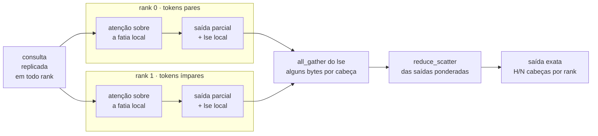

<h1 align="center">ExLlamaV3 · <code>tp-mla</code></h1>

<p align="center">
  <a href="https://github.com/turboderp-org/exllamav3"></a>
  
  
  <a href="#licença"></a>
</p>

<p align="center">
  <b>Tensor parallel e context parallel para os modelos de atenção latente</b><br>
  que o ExLlamaV3 ainda gera numa placa por vez — mais um grafo CUDA que aceita<br>
  atenção em 16 bits, um rascunho DFlash&nbsp;2 e um conversor mais rápido.
</p>

<div align="center">
<table>
<tr>
<td align="center" width="24%"><b><code>1M</code></b> tokens<br><sub>servidos em 2 placas de 96&nbsp;GB</sub></td>
<td align="center" width="24%"><b><code>59,6</code></b> tok/s<br><sub>decode a 1M, igual ao de 200k</sub></td>
<td align="center" width="24%"><b><code>2.991</code></b> tok/s<br><sub>prefill: 959.667 tokens em 5,4&nbsp;min</sub></td>
<td align="center" width="24%"><b><code>4–5&nbsp;%</code></b><br><sub>o que o context parallel custa</sub></td>
</tr>
</table>
</div>

<p align="center">
  <a href="#em-resumo">Em resumo</a> ·
  <a href="#context-parallel-o-cache-repartido-pela-sequência">Context parallel</a> ·
  <a href="#tensor-parallel-para-atenção-latente">Tensor parallel</a> ·
  <a href="#atenção-em-16-bits-dentro-do-grafo-cuda">Grafo CUDA</a> ·
  <a href="#rascunho-dflash-2">DFlash 2</a> ·
  <a href="#conversor-mais-rápido">Conversor</a> ·
  <a href="#experts-na-ram-do-host">Experts na RAM</a> ·
  <a href="#variáveis-de-ambiente">Variáveis</a> ·
  <a href="#instalar">Instalar</a> ·
  <a href="#testes">Testes</a>
</p>

<p align="center">
  <sub>Todo o resto é o upstream, intocado. Leia a
  <a href="https://github.com/turboderp-org/exllamav3#readme">documentação original</a> para o que não estiver aqui.</sub>
</p>

---

## Em resumo

| | O que faz | Efeito medido |
|:--|:--|:--|
| **Context parallel na MLA** | Reparte o cache pela **sequência** e junta as parciais pelo `lse` | **1M de tokens em 2 placas** de 96 GB; o cache latente cai para `1/N` por placa e custa 4–5 % de decode |
| **TP na `MLAttention`** | Fatia as **cabeças de query** entre as placas e replica o latente | Destrava GLM-5.3, GLM-5.3-Flash, DeepSeek V3/V3.1/R1, Kimi K2 e Mistral-4 em várias placas |
| **Atenção fp16 no grafo CUDA** | `BC_MLAttention` e `BC_GatedDeltaNetSplit` aceitam projeções em 16 bits | **+37 % a +69 %** de decode, KL ≤ 0,00007 |
| **Rascunho DFlash 2** | Arquitetura de rascunho própria, com taps no modelo alvo | **2,9–4,4** tokens aceitos por rodada; ganha do MTP em todos os prompts |
| **Conversor mais rápido** | Captura sem sincronizar, estado em memória pinada, cronômetro por fase | **1,7×** mais rápido e KL melhor (0,00249 contra 0,00422) |

---

## Context parallel: o cache repartido pela sequência

Sob tensor parallel o cache latente é replicado inteiro em cada placa, e a 1M de tokens é ele que
decide se o modelo cabe. O context parallel reparte esse cache pelo eixo que sobra, o da
**sequência**: o token `p` mora no rank `p % N`.

```text
posição    0    1    2    3    4    5    6    7    8    9    ...

rank 0     ●         ●         ●         ●         ●           →  cache do rank 0
rank 1          ●         ●         ●         ●         ●      →  cache do rank 1
```

Cada rank calcula a atenção sobre a sua fatia e devolve uma saída parcial mais o `lse`; um
`all_gather` do `lse` e um `reduce_scatter` das saídas ponderadas transformam as parciais no
resultado **exato**.



São dois coletivos pequenos, e juntos custam menos que o único all-reduce que a versão ingênua
— trocar as saídas inteiras entre os ranks — exigiria; é o que mata essa versão assim que entra um
rascunho e o payload multiplica por `q_len`.

> [!NOTE]
> A fatia é **intercalada**, não contígua, e isso não é detalhe. A chave rope carrega a posição
> original, então a atenção sobre uma fatia intercalada é um termo exato da combinação: os kernels
> não precisam saber que faltam tokens no meio. De quebra, a carga causal se equilibra sozinha
> entre os ranks, sem o zigzag que um shard contíguo exigiria.

| Peça | Sob context parallel |
|:--|:--|
| cache latente e rope | **repartido**, `1/N` por placa |
| plano do indexador DSA, k-pool | replicados, em páginas de `PAGE_SIZE × N` |
| `q_proj`, `q_b_proj`, `w_uk_flat` | faixa do **grupo** — cada rank calcula todas as cabeças do grupo |
| `w_uv_flat`, `o_proj` | sub-faixa do **rank**, depois do reduce-scatter |
| página lógica do gerador | `PAGE_SIZE × N` tokens |

Vale nos dois regimes da DSA (denso e esparso acima de `index_topk`), no prefill em chunk, com
rascunho (`q_len > 1`) e **dentro do grafo CUDA**, onde o bloco gravado vira duas fases com o
combine em eager no meio.

```python
model.load(tensor_p = True, tp_options = {"dcp": 2})    # ou EXL3_DCP=2, para quem não expõe tp_options
```

> [!TIP]
> O grau tem de dividir o grau de TP, e o meio-termo costuma ganhar: num TP4, `dcp = 2` reparte o
> cache entre pares de placas e replica só entre os pares, enquanto `dcp = 4` replica os pesos do
> lado Q em todas.

### Quanto libera, e quanto custa

Cache de 1M no GLM-5.3-Flash (4 bpw, 11 camadas com cache), **4× RTX PRO 6000** de 96 GB:

<div align="center">

| Arranjo | Uso por placa | |
|:--|--:|:--|
| TP4 | 57,5 GiB | `█████████████░░░░░░░░░` |
| TP4 · **CP 2** | 52,0 GiB | `████████████░░░░░░░░░░` |
| TP4 · **CP 4** | 49,5 GiB | `███████████░░░░░░░░░░░` |
| autosplit, sem TP | 91,0 GiB | `█████████████████████░` <sub>e 82,3 · 0,5 · 0,5 nas outras três</sub> |

</div>

A série é `11 camadas × 1 GB × (1/N)` ao pé da letra. O preço, nas mesmas quatro placas, a 97k
tokens de contexto e com o grafo ligado:

<div align="center">

| Arranjo | Prefill | Decode | KL / top-1 contra TP4 |
|:--|--:|--:|:--:|
| TP4 | 4.700 tok/s | 59,1 tok/s | régua |
| TP4 · **CP 2** | 4.454 tok/s | 56,9 tok/s | **0,002 / 98 %** |

</div>

**4 a 5 % de decode** em troca do cache repartido. No caminho esparso o CP chega a ficar *mais
rápido* que o TP puro — 150 contra 125 tok/s a 3.000 tokens, num modelo de prova de 4 camadas em
4× RTX 3090 —, porque cada rank só percorre os tokens selecionados que possui.

### 1M de contexto em duas placas

GLM-5.3-Flash 4 bpw servido por TabbyAPI em **2× RTX PRO 6000 WS** de 96 GB, CP 2, cache de
16 bits, grafo CUDA ligado:

<div align="center">

| Prompt | Prefill | Decode | VRAM por placa |
|--:|--:|--:|:--|
| **199.494** tokens | 59 s · 3.405 tok/s | **60,6** tok/s | — |
| **959.667** tokens | 323 s · 2.991 tok/s | **59,6** tok/s | `██████████████████████` 96,5 GB<br>`█████████████████████░` 95,6 GB |

</div>

O decode a 1M é igual ao de 200k: o cache repartido não pesa no passo. E os quatro marcadores
plantados em 5 %, 35 %, 65 % e 95 % do prompt voltaram exatos nos dois tamanhos.

> [!IMPORTANT]
> Velocidade sem recuperação não é contexto longo, é contexto grande. Um artefato pode ter KL
> excelente e não achar um dado no meio do prompt — quem mede isso aqui é
> `tests/bancada/recuperacao_longa.py`.

---

## Tensor parallel para atenção latente

Na v1.4.8 o padrão do motor é `supports_tp: True`, e a maioria das famílias já gera em várias
placas. As que recusavam faziam isso por causa de uma peça só: a `MLAttention`, cujos
`make_tp_allocation` e `tp_export` levantavam `NotImplementedError`.

O desenho é **replicar o pequeno, fatiar as cabeças**:

| Peça | Em cada rank |
|:--|:--|
| `q_a_proj`, `kv_a_proj_with_mqa`, normas, indexador DSA, k-pool, rope | replicados |
| `q_b_proj`, `w_uk_flat`, `w_uv_flat` | colunas das cabeças do rank |
| `o_proj` | linhas das cabeças do rank, seguido de all-reduce |
| caches MLA/DSA | uma instância por rank |

Toda dimensão sai do módulo — `num_q_heads`, `qk_nope_head_dim`, `qk_rope_head_dim`,
`v_head_dim` —, nunca de constante de um modelo. É o que faz a mesma implementação servir ao
GLM-5.3 (rope 64, nope 192), ao Flash (NoPE, nope 256, k-pool) e ao DeepSeek V3.

O mesmo trabalho destravou a variante **KDA** do `GatedDeltaNet` (projeções `q`/`k`/`v`
separadas, portas `f`/`g`, sem `z_proj`), que o Flash usa em 34 das suas 45 camadas.

Cada rank guarda uma cópia inteira do cache latente: é MQA, uma cabeça só, sem por onde fatiar
por cabeça — a mesma escolha que vLLM e TensorRT-LLM fazem. Quem quer contexto longo reparte esse
cache pelo outro eixo, o da sequência: é o
[context parallel](#context-parallel-o-cache-repartido-pela-sequência).

### Prazo dos coletivos, configurável

> [!WARNING]
> O backend nativo aborta o grupo quando um rank espera demais num coletivo, e o upstream fixa
> 90 s dentro do kernel. A primeira geração compila os kernels Triton dos caminhos MLA e KDA em
> cada rank, e o mestre ainda compila os do rascunho: 90 s estouram numa máquina sã.

Aqui o prazo vive no `PGContext` e vem de `EXLLAMA_TP_SYNC_TIMEOUT`.

---

## Atenção em 16 bits dentro do grafo CUDA

Antes, o caminho de grafo exigia projeções EXL3, e qualquer checkpoint com atenção em 16 bits
decodificava em modo eager. Agora `BC_MLAttention` (`q_a`, `q`, `kv_a`, `o`, `idx_wq_b`) e
`BC_GatedDeltaNetSplit` no modo KDA (`qkv`, `o`) aceitam `BC_LinearFP16`.

Um GEMM EXL3 é um nó de kernel com sites patcháveis; um fp16 é um nó cuBLAS sem site nenhum,
então roda entre buffers estáticos: `x` copiado uma vez para `x_st` no topo do grafo, saída do
`o_proj` em `y_st` copiada para `y` no fim, operandos com `R_pad = max(R, 8)` linhas — abaixo de
M = 8 o cuBLASLt escolhe um kernel cerca de 13× mais lento.

<div align="center">

| Arranjo | eager | grafo | ganho | KL | top-1 |
|:--|--:|--:|:--:|--:|--:|
| 1 placa, contexto curto | 140 tok/s | 192 tok/s | **+37 %** | 0,00001 | 100 % |
| 1 placa, 3.000 tokens | 125 tok/s | 185 tok/s | **+48 %** | 0,00006 | 100 % |
| TP2, contexto curto | 137 tok/s | 195 tok/s | **+42 %** | 0,00007 | 100 % |
| TP2, 3.000 tokens | 117 tok/s | 198 tok/s | **+69 %** | 0,00002 | 100 % |

</div>

---

## Rascunho DFlash 2

Arquitetura de rascunho própria (`exllamav3/architecture/dflash2.py` e
`modules/arch_specific/dflash2.py`), que lê estados do modelo alvo por taps em vez de rodar um
modelo separado do zero. Funciona com o alvo em tensor parallel, com os ids crus dos taps — a
mesma convenção da implementação de referência e do SGLang.

Aceita **2,9 a 4,4 tokens por rodada** e ganha do MTP em todos os prompts da régua na mesma
máquina:

<div align="center">

| Prompt curto | Prompt longo | Prompt difícil |
|:--:|:--:|:--:|
| **+10 a 15 %** | **+50 a 65 %** | **+29 %** |

</div>

---

## Conversor mais rápido

O `convert_model.py` do upstream ganhou quatro mudanças que valem em qualquer modelo:

- **Captura sem sincronizar o host.** `capture_H` não faz mais um `sync` por chamada; linhas com
  `inf`/`nan` viram zero e são descontadas por um contador que vive no device.
- **Estado de calibração em memória pinada** (`EXL3_PIN_STATE`, ligado por padrão). O avanço
  entre camadas caiu de 40 s para 15 s no corte medido.
- **Cronômetro por fase e por grupo** (`EXL3_CONVERT_TIMING=1`): carga, captura, quantização,
  gravação e avanço, com subfases dentro da quantização.
- **Passo opcional na etapa fina da busca de escala** (`EXL3_GSCALE_STAGE2_STRIDE`).

Mais três correções de robustez: o `ckpt_old` é apagado antes de compilar (o pico de disco
derrubava conversões grandes); o `compile` não grava o mesmo tensor em dois shards; e o
`quantization_config.bits` sai inteiro, com o valor exato em `bpw`, que é o que o validador do
Hugging Face Hub exige.

<div align="center">

| No mesmo corte, com a mesma receita | Antes | Agora |
|:--|--:|--:|
| tempo total | 28 min | **16,8 min** |
| KL contra o BF16 | 0,00422 | **0,00249** |

</div>

Duas placas no mesmo host escalam **1,8×** na quantização.

---

## Experts na RAM do host

> [!NOTE]
> Esta parte é **do upstream** — o fork apenas a documenta e a mediu de ponta a ponta, porque ela
> quase não aparece na documentação original.

Ela deixa um MoE grande caber numa placa que não comportaria os pesos: os experts roteados moram
na RAM e um worker de CPU os calcula.

| Variável | O que significa |
|:--|:--|
| `EXL3_MOE_CPU_OFFLOAD=N` | **N camadas MoE inteiras** vão para a CPU. Não é interruptor: `=1` manda só a primeira camada elegível |
| `EXL3_MOE_CPU_SPLIT=N` | Os **N experts de cauda de cada camada** vão para a CPU, com colocação dinâmica entre quente e frio |
| `EXL3_MOE_CPU_THREADS` | Threads do worker; o padrão é metade dos núcleos |

> [!IMPORTANT]
> Exigência: experts com codebook **`mul1`**. Sob **tensor parallel** o split funciona no modo de
> canais (`EXL3_TP_MOE_TENSOR_SPLIT=1` junto com `EXL3_MOE_CPU_SPLIT`), contribuição deste fork; o
> offload de camada inteira (`EXL3_MOE_CPU_OFFLOAD`) continua só na divisão por camadas, porque é
> lá que a camada existe inteira num lugar só.

Medido num modelo de 321 B (180 GB em EXL3 4 bpw) numa placa de 94 GB com 314 GB de RAM:

<div align="center">

| Experts de cada camada na RAM | Uso da placa | Decode | Prefill |
|:--|--:|--:|--:|
| 288 de 288 (tudo) | ~13 GB | 15,0 tok/s | 1.395–1.458 tok/s |
| 224 (78 %) | ~50 GB | 19,8–21,3 tok/s | 1.580–1.634 tok/s |
| 192 (67 %) | ~65 GB | 22,1–23,6 tok/s | 1.685–1.752 tok/s |
| 160 (56 %) | 81 GB | 24,5–25,9 tok/s | 1.819–1.888 tok/s |

</div>

**O prefill paga menos que o decode, mas paga.** O motor faz streaming dos experts pela placa na
leitura do prompt em vez de calculá-los na CPU, e num corte de poucas camadas o custo some. No
modelo inteiro ele aparece: no mesmo modelo de 321 B, em 2 placas com 28,8 % dos experts na RAM, o
prefill ficou em **1,65k tok/s** contra 4,2–4,8k em 4 placas com tudo na VRAM. Metade das placas
explica cerca de metade da diferença; o resto é o offload. O decode continua sendo onde dói, e é
quase linear na fração que está na RAM.

<details>
<summary><b>Quais experts moram na RAM — e como colher o perfil que decide isso</b></summary>

<br>

`EXL3_MOE_CPU_SPLIT=N` manda os **N últimos por índice**, que é uma escolha arbitrária: o
roteamento de um MoE é muito desigual, e mandar experts quentes para a memória lenta custa caro em
cada token. Dois caminhos corrigem isso, e o segundo ganhou o lado que faltava:

| Variável | Padrão | Para quê |
|:--|:--:|:--|
| `EXL3_MOE_CPU_SWAP` | `1` | Colocação dinâmica: promove o expert mais quente da CPU ao slot do mais frio da GPU |
| `EXL3_MOE_CPU_SWAP_INTERVAL` | `128` | Passos de decode entre varreduras |
| `EXL3_MOE_CPU_SWAP_FLOOR` | `8.0` | Piso para promover, em múltiplos da expectativa uniforme |
| `EXL3_MOE_CPU_SWAP_HYST` | `2.0` | Razão quente/frio exigida para trocar |
| `EXL3_MOE_CPU_SPLIT_STATS` | — | Colocação **estática** por um perfil de roteamento; quando o arquivo existe, vence a dinâmica |
| `EXL3_MOE_CPU_SPLIT_STATS_OUT` | — | **Escreve** esse perfil enquanto o modelo serve (deste fork) |

Os padrões do modo dinâmico são conservadores: com 288 experts, o piso de 8× a expectativa
uniforme exige 28 acertos num mesmo expert dentro da janela de 128 passos, e respostas curtas de
agente terminam antes. Para uso interativo vale afrouxar — `EXL3_MOE_CPU_SWAP_INTERVAL=32`,
`EXL3_MOE_CPU_SWAP_FLOOR=2`.

O caminho estático é o mais forte, porque a colocação já nasce certa e vale para toda máquina
futura. Só faltava produzir o arquivo: **`EXL3_MOE_CPU_SPLIT_STATS_OUT=<caminho>`** despeja as
contagens por camada, indexadas por id de roteador, no formato que `EXL3_MOE_CPU_SPLIT_STATS` lê
de volta.

Apontar as **duas** variáveis para o mesmo caminho fecha o ciclo sozinho: na primeira subida o
arquivo não existe, a colocação dinâmica age e o perfil é colhido; nas seguintes o perfil existe e
manda. Arquivo ausente, ilegível, corrompido ou de outro modelo (largura diferente) volta para a
dinâmica sem derrubar o carregamento. Escreve depois de cada varredura, e não no encerramento,
porque máquina alugada costuma morrer sem desligar limpo; a troca é atômica.

> [!TIP]
> Sirva um dia de trabalho **real** com o despejo ligado — perfil de prompt sintético roteia perto
> do uniforme e não ensina nada — e depois suba com `EXL3_MOE_CPU_SWAP=0` e
> `EXL3_MOE_CPU_SPLIT_STATS` apontando para ele.

Quanto isso vale, medido no GLM-5.3-Flash com o perfil de um dia de trabalho real (42 camadas MoE,
48,3 milhões de seleções de expert): mandando para a RAM os **198 experts mais frios** de cada
camada em vez dos 198 últimos por índice, a fração das leituras que cai na memória lenta vai de
**68,8 % para 22,3 %** — **3,1× menos**, sem mudar quantos experts moram lá.

</details>

---

## Variáveis de ambiente

As que este fork acrescenta ou torna configuráveis:

| Variável | Padrão | Para quê |
|:--|:--:|:--|
| `EXL3_DCP` | `1` | Grau de context parallel, para quem carrega sem `tp_options` (TabbyAPI). Tem de dividir o grau de TP |
| `EXLLAMA_TP_SYNC_TIMEOUT` | `90` | Prazo dos coletivos nativos, em segundos |
| `EXL3_BC_GDN` | `1` | Caminho fundido do KDA no grafo CUDA |
| `EXL3_BC_GDN_TRACE` | — | Traço do caminho do KDA |
| `EXL3_BC_GDN_EAGER` | — | Roda o caminho fundido sem captura, para comparar |
| `EXL3_PIN_STATE` | `1` | Estado de calibração em memória pinada, na conversão |
| `EXL3_CONVERT_TIMING` | — | Tempo por fase e por grupo, na conversão |
| `EXL3_GSCALE_STAGE2_STRIDE` | — | Passo da etapa fina da busca de escala |
| `EXL3_TP_MOE_TENSOR_SPLIT` | — | Experts na RAM sob tensor parallel, no modo de canais |
| `EXL3_MOE_CPU_SPLIT_STATS_OUT` | — | Despeja o perfil de roteamento por camada, para a colocação estática |

> [!TIP]
> O caminho de grafo da MLA compartilha o interruptor do upstream: `EXL3_BC_ATTN=0` desliga, e
> `EXL3_BC_ATTN_TRACE=1` diz módulo a módulo por que o grafo foi recusado — útil quando um artefato
> com atenção em 16 bits ou uma geometria inesperada faz o motor cair no despacho sem avisar.

---

## Instalar

Torch com CUDA 12.4 ou mais novo instalado à parte, depois:

```sh
pip install -r requirements.txt
MAX_JOBS=4 pip install -e .
```

`TORCH_CUDA_ARCH_LIST` restringe a compilação a uma arquitetura e economiza minutos:

<div align="center">

| Placa | Valor |
|:--|:--:|
| RTX 3090 | `8.6` |
| RTX 4090 | `8.9` |
| RTX 5090 · RTX PRO 6000 | `12.0` |

</div>

Para instalar num commit fixo, como um servidor faria:

```sh
pip install git+https://github.com/Olt1z/exllamav3-tp-mla@<commit>
```

---

## Testes

```sh
python tests/tp_mla_smoke.py --tp              # carrega em 2 placas e compara com a placa única
python tests/test_tp_mla_import.py             # importação exata da MLAttention fatiada
python tests/test_dflash2_referencia.py        # o rascunho contra a implementação de referência
python tests/bancada/provar_plano_cp.py        # o plano de context parallel, SEM GPU
python tests/bancada/provar_cp_denso.py        # combine denso contra a placa única
python tests/bancada/provar_cp_esparso.py      # combine esparso, acima de index_topk
python tests/bancada/provar_fatia_do_cache.py  # a união das fatias reproduz o cache inteiro, bit a bit
```

Contra um servidor já no ar:

```sh
python tests/bancada/recuperacao_longa.py URL TOKEN --tokens 200000,1000000
```

Ele planta marcadores em posições percentuais do prompt e exige os quatro de volta, exatos — e
desconfia do próprio resultado: nonce na primeira linha (senão o cache de prefixo responde pelo
modelo), `prompt_tokens` do servidor batendo o alvo (senão o contexto foi truncado em silêncio) e
tokens em cache iguais a zero.

> [!NOTE]
> O teste de fumaça gera 64 tokens greedy e compara os logits com a placa única. A comparação é por
> KL contra o **ruído medido entre duas execuções idênticas**: o ExLlamaV3 não é determinístico bit
> a bit, e cerca de 9 % das posições mudam entre leituras iguais.

---

## Licença

MIT, todo o mérito do motor é do
[turboderp](https://github.com/turboderp-org/exllamav3) e da comunidade do ExLlama; este fork
acrescenta as peças acima e devolve o que for genérico.
